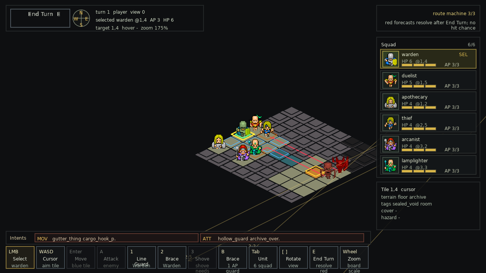
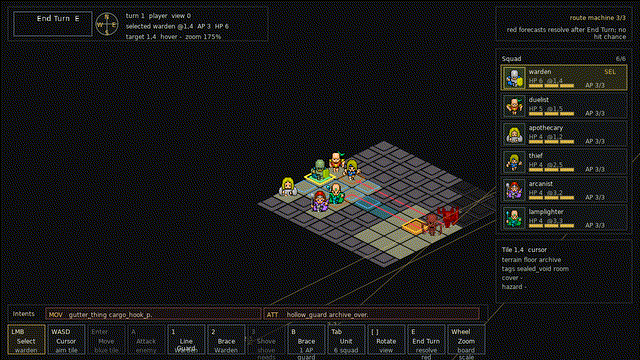

# Thoth

Deterministic XCOM-lite tactics in a cursed archive: six auditors read intent, bend cover, and survive institutional horror without hit-roll RNG.

<p align="center">
  
  <br>
  
</p>

## Development

```sh
make check
```

Useful targets:

- `make run`
- `make test`
- `make package-build`
- `make benchmark-scaled`

Roadmap source of truth: `TODO.md`.
