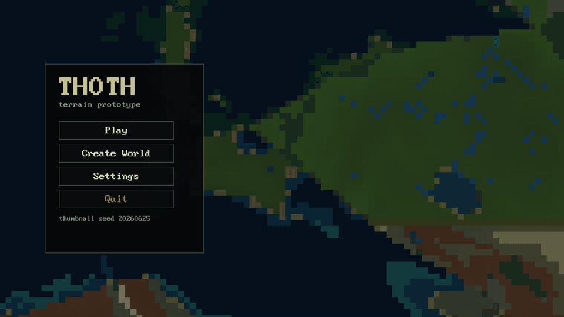
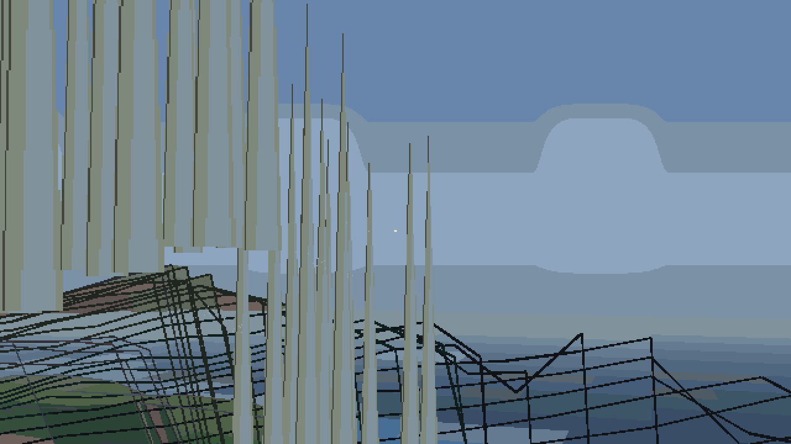
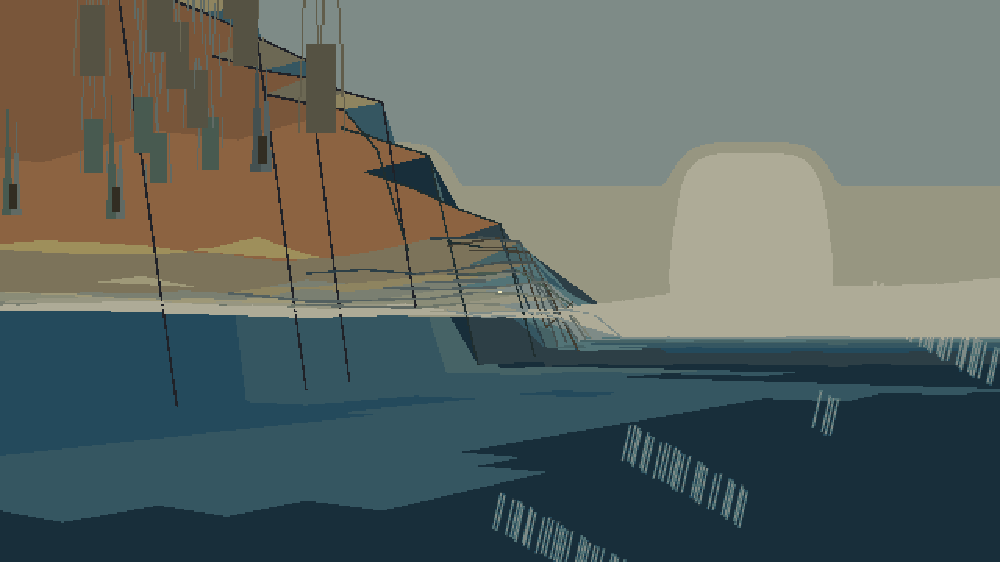
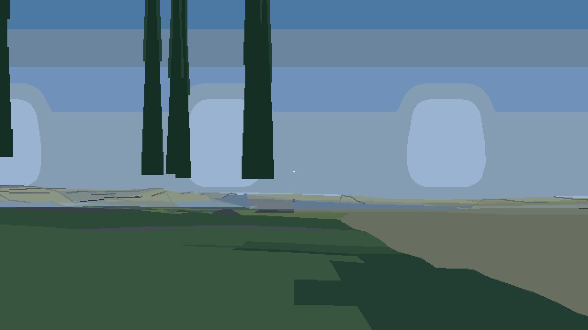
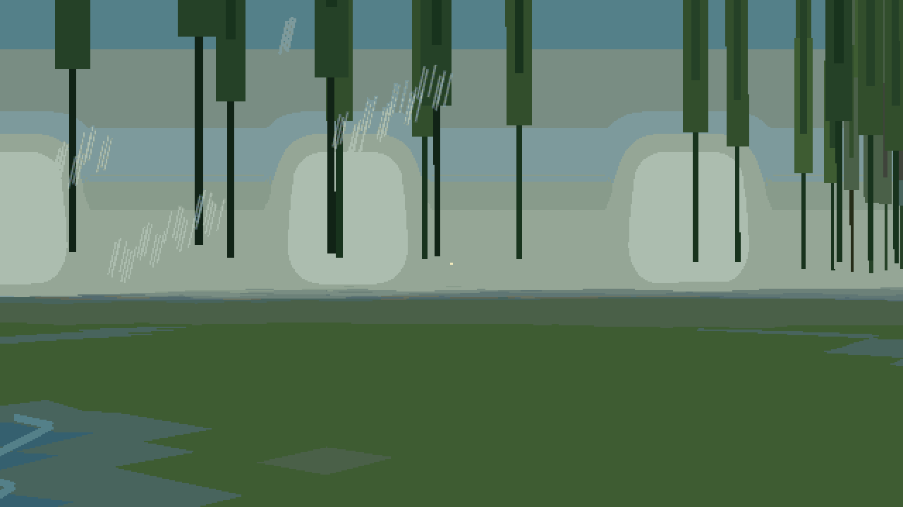
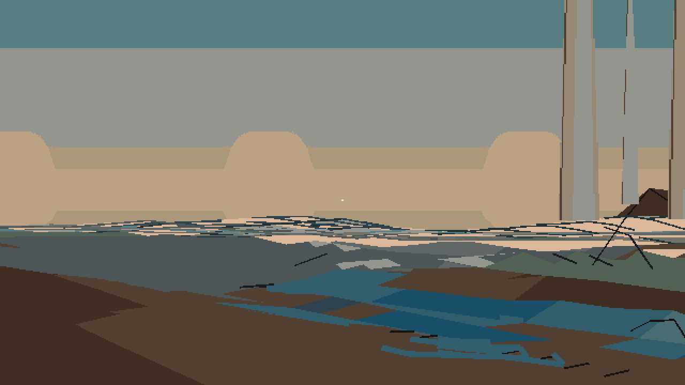
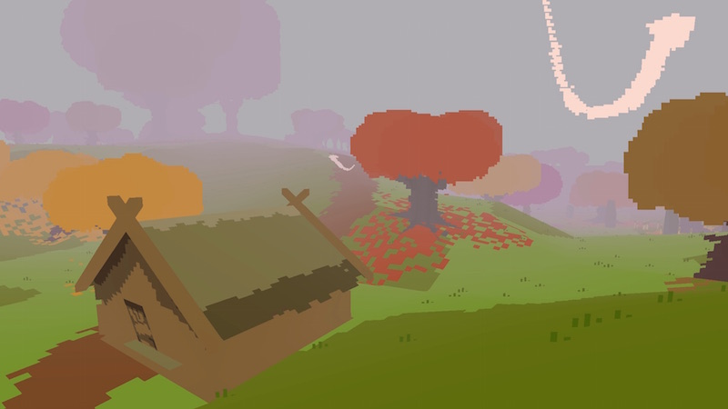

[](https://github.com/gongahkia/thoth/releases/tag/1.0)


# `Thoth`

[Research-backed](#research) infinite walking simulator in a
[procedurally generated world](#terrain-generation-techniques).

<div align="center">
    
</div>

## Stack

* *Scripting*: [Lua](https://www.lua.org/), [LÖVE2D](https://love2d.org/)
* *Tests*: [LuaJIT](https://luajit.org/) 

## Assets

* *Font*: [BigBlue Terminal](https://int10h.org/blog/2015/12/bigblue-terminal-oldschool-fixed-width-font/)
* *Sprites*: [Custom billboard texture atlas](./assets/billboards.png)

## Screenshots

<div align="center">
    
    
</div>
<div align="center">
    
    
</div>
<div align="center">
    
    
</div>

## Usage

The below commands are for locally running `Thoth`.

1. First install `Thoth` on your current machine.

```console
$ git clone https://github.com/gongahkia/thoth && cd thoth
```

2. Then run any of the below to start `Thoth`.

```console
$ make run
```

### Controls

| Key | Action |
|:---:|--------|
| `WASD` | walk / strafe |
| `Shift` | sprint |
| mouse / `E` / `<` | look |
| `^` / `v` | pitch |
| `F` | toggle mouse look |
| `B` | toggle all debug panels |
| `1` / `2` / `3` / `4` | toggle plate / drainage / erosion / biome overlay |
| `5` | toggle topographic map overlay |
| `T` | toggle debug topographic map |
| `M` | toggle minimap |
| `N` | mark surveyed terrain |
| `L` | toggle perf overlay |
| `[` / `]` | step season |
| `F5` / `F9` | save / load |
| `Q` / `Esc` | quit |
| `R` | new seed |

3. Finally, optionally execute the below to interact with `Thoth`'s functionality.

```console
$ make test
$ make smoke
$ make diagnostics
$ make regressions
$ make benchmark
$ make bench
$ make bench-update
$ make render-smoke
$ make walk-smoke
$ make export-smoke
```

### Additional configuration

```console
$ love . --skip-menu
$ love . --debug-perf
$ love . --walk-smoke --walk-smoke-frames 240 --perf-interval 0.5
$ love . --preload-radius 128 --refresh-preload-radius 96
$ love . --cache-max-entries 512
$ love . --hydrology-region-chunks 2 --hydrology-halo 8
$ love . --hydrology-basin-chunks 8 --hydrology-basin-stride 4
$ love . --export-map dist/map --export-size 128
$ love . --save-path thoth-save.json --load-save thoth-save.json
$ love . --scope local|region|continent
$ love . --geologic-time 0.5
$ love . --pixel-scale 2 --time-of-day 0.25 --season summer --day-length 60
$ love . --no-async
```

## Nerd stuff

### Terrain generation techniques

`Thoth` is a deterministic pipeline: the `(seed, geologicTime)` pair is the entire determinism contract, and every stage below is reproducible for a given pair.

#### Layer 1: Noise base

[OpenSimplex2](https://github.com/KdotJPG/OpenSimplex2) — [Kurt Spencer's successor](https://en.wikipedia.org/wiki/OpenSimplex_noise) to Perlin/simplex noise, chosen for visual isotropy and lack of directional artefacts — is implemented from scratch in [`src/noise.lua`](./src/noise.lua) together with fBm, ridge, and domain-warp modulators. Multi-octave sampling feeds the tectonic mask, uplift, and continental heightfield.

#### Layer 2: Plate tectonics

[`src/worldgen.lua`](./src/worldgen.lua) builds a plate mosaic with per-plate velocities, age, and boundary flags (subduction, rift, transform), driving uplift belts, island arcs, shields/cratons, and passive-margin shelves. This follows the [PlaTec / Viitanen (2012) approach to physically based plate-tectonic terrain synthesis](https://www.theseus.fi/bitstream/handle/10024/40422/Viitanen_Lauri_2012_03_30.pdf) and the [large-scale uplift + fluvial model of Cordonnier et al. 2016](https://onlinelibrary.wiley.com/doi/10.1111/cgf.12820). `--geologic-time` advances plates along their velocity vectors (tanh-clamped below 80% of half plate-cell so plates never collide).

#### Layer 3: Mountain orometry

[`src/orometry.lua`](./src/orometry.lua) blends six archetypes (alps, appalachians, himalaya, andes, fjordland, basinrange) via peak-amplitude, ridge-frequency, and relief scales. Orometric descriptors (prominence, isolation, ridges, saddles) are exposed through `WorldGen:discoveriesAt(x, y, scale)` and used for discovery labels, echoing the [orometry-based terrain analysis + synthesis framework of Argudo et al. 2019](https://dl.acm.org/doi/10.1145/3355089.3356535) and the prominence/isolation definitions from [Kirmse & de Ferranti 2017](https://journals.sagepub.com/doi/abs/10.1177/0309133317738163).

#### Layer 4: Hydrology

[`src/hydrology.lua`](./src/hydrology.lua) implements a heap-based [Priority-Flood depression filling pass (Barnes, Lehman & Mulla 2014)](https://rbarnes.org/sci/2014_depressions.pdf) followed by [D8 downstream routing (O'Callaghan & Mark 1984)](https://www.sciencedirect.com/science/article/pii/0734189X84800110). Flow accumulation is computed in reverse-topological order; basins, watersheds, terminal cells, and lake surfaces are labelled in the same sweep. Endorheic basins get grouped fill/spillover so drainage never terminates in an interior pit.

#### Layer 5: Fluvial erosion

[`src/erosion.lua`](./src/erosion.lua) applies the [stream-power incision law (Whipple & Tucker 1999)](http://geosci.uchicago.edu/~kite/doc/Whipple_and_Tucker_1999.pdf) — `E = K · A^m · S^n` — with a debris-flow branch that switches to a critical-slope equilibrium above a sediment-concentration threshold. An isostatic-rebound Gaussian kernel and an incision floor prevent runaway carving.

#### Layer 6: Glacial erosion

Ice-sheet abrasion + pluck in [`src/erosion.lua`](./src/erosion.lua) is driven by the [Shallow Ice Approximation (SIA)](https://agupubs.onlinelibrary.wiley.com/doi/full/10.1029/2021RG000754) with basal sliding — velocity-scaled abrasion, thickness persistence between passes, and gradient-driven flow.

#### Layer 7: Hillslopes and periglacial

[`src/hillslope.lua`](./src/hillslope.lua) uses non-linear critical-slope diffusion (Culling-style linear diffusion regularised by a critical-slope singularity) with separate regolith / bedrock diffusivities. [`src/periglacial.lua`](./src/periglacial.lua) stamps pingos, palsas, and polygonal ground in cold cells and adds solifluction lobes.

#### Layer 8: Climate and biomes

[`src/climate.lua`](./src/climate.lua) resolves orographic precipitation with wind-gradient lift + lee rain-shadow drying, in the spirit of the [Smith & Barstad 2004 linear theory of orographic precipitation](https://journals.ametsoc.org/view/journals/atsc/61/12/1520-0469_2004_061_1377_altoop_2.0.co_2.xml). [`src/biomes.lua`](./src/biomes.lua) maps temperature × precipitation onto a Whittaker-style grid and cross-references [Köppen-Geiger](https://www.britannica.com/science/Koppen-climate-classification) letters. [`src/soil_classify.lua`](./src/soil_classify.lua) assigns USDA soil orders (entisol, inceptisol, mollisol, vertisol, aridisol, histosol, spodosol, oxisol, andisol, ultisol) from climate + slope + lithology + age.

#### Layer 9: Specialist landforms

Coastal cliffs / capes / spits / lagoons ([`src/coast.lua`](./src/coast.lua)); karst sinkholes, cenotes, and dissolution over carbonate lithology ([`src/karst.lua`](./src/karst.lua)); latitude-driven fringing / barrier / atoll reefs ([`src/reef.lua`](./src/reef.lua)); Werner-style unimodal / bimodal / multimodal dune migration ([`src/aeolian.lua`](./src/aeolian.lua), following [Werner 1995](https://www.semanticscholar.org/paper/Eolian-dunes%3A-Computer-simulations-and-attractor-Werner/f4bcbb6796fd011e2f36d7cff373fc6ec486ea18)); stratovolcano vs. shield cone stamping ([`src/volcano.lua`](./src/volcano.lua)); shelf-distance + shelf-edge detection ([`src/bathymetry.lua`](./src/bathymetry.lua)); meander detection + oxbow marking ([`src/meander.lua`](./src/meander.lua)).

### Rendering 

Heightfields are drawn through [GPU-based geometry clipmaps (Losasso & Hoppe 2004)](https://hhoppe.com/proj/gpugcm/) in [`src/clipmap.lua`](./src/clipmap.lua) with persistent streamed meshes and per-cell sun-direction lighting. A low-resolution canvas + 32-colour palette-quantisation shader in [`src/postfx.lua`](./src/postfx.lua) is swapped per active view-scope for the [Proteus](https://store.steampowered.com/app/219680/Proteus/) look. [`src/atmosphere.lua`](./src/atmosphere.lua) drives a four-grade dawn/noon/dusk/night day cycle × four seasons, tinting the palette and the sun vector.

### Performance optimisation

#### Streaming and LOD

Geometry clipmaps in [`src/clipmap.lua`](./src/clipmap.lua) cache nested regular grids around the camera, so only ring-buffer edges are re-uploaded as the player walks — the [Losasso & Hoppe 2004](https://hhoppe.com/proj/gpugcm/) invariant that keeps rendering rate steady regardless of world size. Runtime initial preload defaults to 64 cells; refresh preload defaults to 72 cells. Raise them to trade first-render latency for fewer walking stalls.

#### Bounded caches

[`src/lru.lua`](./src/lru.lua) is an O(1) doubly-linked-list LRU used for chunk-region, basin, and hydrology caches. Hits / misses / evictions surface in the `--debug-perf` overlay so cache thrash is visible. `--cache-max-entries` caps memory use for long sessions.

#### Async hydrology worker

[`src/worker.lua`](./src/worker.lua) offloads Priority-Flood + D8 + climate solves to a background LÖVE thread over a job / response channel, so the render thread never blocks on a basin fill. `--no-async` collapses this back onto the main thread (useful for determinism debugging).

#### Two-tier hydrology resolution

Fine-grained region passes (default `--hydrology-region-chunks 2 --hydrology-halo 8`) resolve local flow, while a coarser basin pass (`--hydrology-basin-chunks 8 --hydrology-basin-stride 4/8`) preserves large river corridors and inter-basin spillover cheaply. Interactive defaults drop region-halo to `0` and basin-stride to `8` to keep first render bounded.

#### Regression benchmarking

[`tests/bench.lua`](./tests/bench.lua) with `tests/bench.baseline.json` gates commits against a checked-in baseline (`make bench` at 50% tolerance for local dev, direct `--baseline-tolerance 0.1` for CI). `make bench-update` rewrites the baseline. The `bench-baseline` artefact is uploaded from CI.

#### Dt clamping

Runtime clamps simulation `dt` after slow terrain loads so movement doesn't jitter — a "hitch swallower" between world-gen frames and steady state.

#### Runtime diagnostics

`--debug-perf` (toggle `L` in-game) prints FPS, raw + clamped `dt`, update / draw / preload ms, visible / preloaded chunk counts, cache hit / miss / eviction counts, terrain and basin cache misses, and hydrology cell counts. `--debug-panels` starts with plate / drainage / erosion / biome panels open (`B` toggles them).

### Benchmarks

`Thoth` currently has 2 different benchmarking layers.

1. **Micro-benchmarks** — [`tests/bench.lua`](./tests/bench.lua) generates worlds at scope × chunk-radius combinations, times region / basin / erosion / climate solves, and gates against [`tests/bench.baseline.json`](./tests/bench.baseline.json). `make bench` fails on regressions worse than the tolerance (50% locally, 10% in CI).
2. **Runtime smoke** — `make walk-smoke` runs a headless `love . --walk-smoke --walk-smoke-frames 240 --perf-interval 0.5` traversal, streaming perf samples every half-second so first-render + walk-hitch regressions surface without a monitor. `make render-smoke` and `make export-smoke` cover render init + map-export paths respectively.

Terrain diagnostics report land / water / river / lake / slope / biome ratios, seam mismatches, and uphill-drainage rejects:

```sh
make diagnostics
luajit tests/run.lua --diagnostics --seed-start 1 --seed-count 32
luajit tests/run.lua --diagnostics --seeds 1,42,99,20260625 --chunk-radius 2 --sample-step 8
luajit tests/run.lua --regressions
luajit tests/bench.lua --chunk-radius 1 --scales local,region,continent
```

Fixture sweeps cover ten regression categories: `ugly_terrain`, `all_water`, `all_land`, `riverless`, `single_biome`, `biome_count_low`, `steep_slopes`, `drowned_basin`, `broken_seams`, and `river_discontinuities`. Bounds are broad Earth-inspired calibration gates, not strict geoscience targets — the terrain-first guard rejects runtime ruins, lore, quests, collectibles, combat, or survival systems until landform generation is coherent.

## Research

`Thoth `

* [Priority-flood: An optimal depression-filling and watershed-labeling algorithm for digital elevation models](https://rbarnes.org/sci/2014_depressions.pdf) by Richard Barnes, Clarence Lehman and David Mulla
* [Dynamics of the stream-power river incision model: Implications for height limits of mountain ranges, landscape response timescales, and research needs](https://agupubs.onlinelibrary.wiley.com/doi/10.1029/1999JB900120) by Kelin X Whipple and Gregory E Tucker
* [The extraction of drainage networks from digital elevation data](https://www.sciencedirect.com/science/article/pii/0734189X84800110) by John F O'Callaghan and David M Mark
* [The synthesis and rendering of eroded fractal terrains](https://dl.acm.org/doi/10.1145/74334.74337) by F Kenton Musgrave, Craig E Kolb and Robert S Mace
* [A Linear Theory of Orographic Precipitation](https://journals.ametsoc.org/view/journals/atsc/61/12/1520-0469_2004_061_1377_altoop_2.0.co_2.xml) by Ronald B Smith and Idar Barstad
* [Geometry clipmaps: Terrain rendering using nested regular grids](https://hhoppe.com/proj/geomclipmap/) by Frank Losasso and Hugues Hoppe
* [Terrain Rendering Using GPU-Based Geometry Clipmaps](https://developer.nvidia.com/gpugems/gpugems2/part-i-geometric-complexity/chapter-2-terrain-rendering-using-gpu-based-geometry) by Arul Asirvatham and Hugues Hoppe
* [Physically Based Terrain Generation: Procedural Heightmap Generation Using Plate Tectonics](https://www.theseus.fi/bitstream/handle/10024/40422/Viitanen_Lauri_2012_03_30.pdf) by Lauri Viitanen
* [Large Scale Terrain Generation from Tectonic Uplift and Fluvial Erosion](https://onlinelibrary.wiley.com/doi/10.1111/cgf.12820) by Guillaume Cordonnier, Jean Braun, Marie-Paule Cani, Bedrich Benes, Éric Galin, Adrien Peytavie and Éric Guérin
* [Authoring Landscapes by Combining Ecosystem and Terrain Erosion Simulation](https://dl.acm.org/doi/10.1145/3072959.3073667) by Guillaume Cordonnier, Éric Galin, James Gain, Bedrich Benes, Éric Guérin, Adrien Peytavie and Marie-Paule Cani
* [Orometry-based Terrain Analysis and Synthesis](https://dl.acm.org/doi/10.1145/3355089.3356535) by Oscar Argudo, Éric Galin, Adrien Peytavie, Axel Paris, James Gain and Éric Guérin
* [Calculating the prominence and isolation of every mountain in the world](https://journals.sagepub.com/doi/abs/10.1177/0309133317738163) by Andrew Kirmse and Jonathan de Ferranti
* [Ice-Dynamical Glacier Evolution Modeling — A Review](https://agupubs.onlinelibrary.wiley.com/doi/full/10.1029/2021RG000754) by Harry Zekollari, Matthias Huss, Daniel Farinotti and Surendra Adhikari
* [Modeling the flow of glaciers in steep terrains: The integrated second-order shallow ice approximation (iSOSIA)](https://ui.adsabs.harvard.edu/abs/2011JGRF..116.2012E/abstract) by David L Egholm, Mads F Knudsen, C D Clark and Jonathan E Lesemann
* [Analytical theory of erosion](https://www.journals.uchicago.edu/doi/10.1086/626606) by W E H Culling
* [Eolian dunes: Computer simulations and attractor interpretation](https://www.semanticscholar.org/paper/Eolian-dunes%3A-Computer-simulations-and-attractor-Werner/f4bcbb6796fd011e2f36d7cff373fc6ec486ea18) by Bradley T Werner
* [Procedural generation of 3D karst caves with speleothems](https://www.sciencedirect.com/science/article/abs/pii/S0097849321002132) by Axel Paris, Éric Guérin, Adrien Peytavie, Pauline Collon and Éric Galin
* [Interactive terrain modeling using hydraulic erosion](https://dl.acm.org/doi/abs/10.5555/1632592.1632622) by Ondrej Št'ava, Bedrich Benes, Matthew Brisbin and Jaroslav Křivánek
* [Methods for Procedural Terrain Generation: A Review](https://link.springer.com/chapter/10.1007/978-3-030-21077-9_6) by Jonas Freiknecht and Wolfgang Effelsberg
* [Terrain simulation using a model of stream erosion](https://dl.acm.org/doi/10.1145/54852.378519) by Alex D Kelley, Michael C Malin and Gregory M Nielson
* [Polygon Map Generation](https://www.redblobgames.com/maps/terrain-from-noise/) by Amit Patel
* [OpenSimplex2](https://github.com/KdotJPG/OpenSimplex2) by Kurt Spencer

## References

Visually, `Thoth` takes a lot of reference from the 2013 game [Proteus](https://store.steampowered.com/app/219680/Proteus/) by [Ed Key and David Kanaga](https://en.wikipedia.org/wiki/Proteus_(video_game)).

<div align="center">
    
</div>
