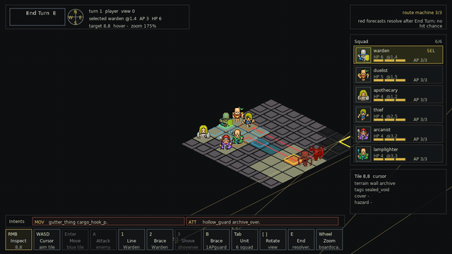

# Itch Devlog Draft - Vertical Slice RC1

Status: draft copy. Paste into itch.io after the `vertical-slice-rc1` build is uploaded.

Header media:

- `assets/previews/itch-tactical-devlog-30s.gif` - 30-second 640x360 tactical GIF.

## Title

Thoth vertical slice RC1: deterministic tactics in the Buried Archive

## Body

Pitch: Deterministic XCOM-lite tactics in a cursed archive: six auditors read intent, bend cover, and survive institutional horror without hit-roll RNG.

This vertical slice moves Thoth fully into deterministic squad tactics. The current playable slice is the Buried Archive: six auditors deploy into compact tactical boards where filing lanes, audit beams, cover edges, fog-of-war, overwatch cones, and red intent notices define the fight before anything resolves.

What is in this RC:

- Six distinct squad classes with board verbs and AP pools.
- Six Buried Archive tactical mission variants.
- Fog-of-war, hidden intent reveal, overwatch cones, directional cover, flanking, objective pressure, route metadata, and deterministic replay coverage.
- Procgen validation for fixed seed batches.
- Current tactical screenshots and the 30-second GIF above.

What is not in this RC:

- Salt Cistern and Ember Warrens are future-zone content.
- Long-form campaign endings, public trailer footage, and native platform builds are still release follow-up work.
- No random hit/miss rolls have been added; board setup can vary, but declared tactical outcomes stay deterministic.

Feedback I need:

- Did any intent, fog, cover, or overwatch preview feel unclear before you acted?
- Did the six-unit HUD stay readable during planning?
- Did any generated Buried Archive board feel unwinnable, empty, or too noisy?
- Did the no-hit-roll combat promise match what you actually saw?

Build note:

- Local package: `dist/thoth.love`
- Git tag: `vertical-slice-rc1`
- Recommended download label: `Thoth vertical slice RC1 - LOVE package`
